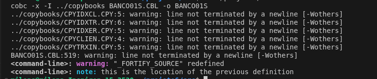
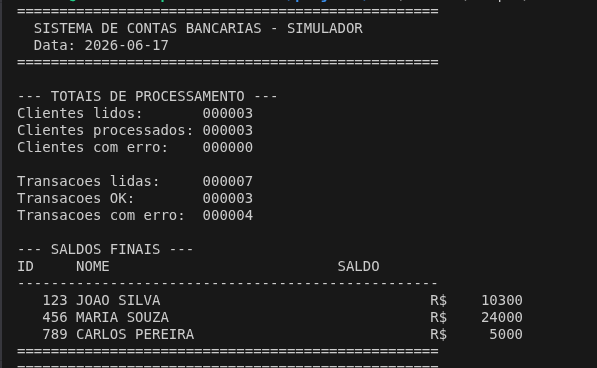
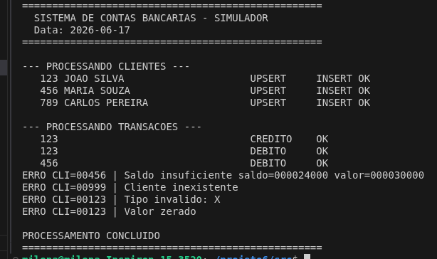
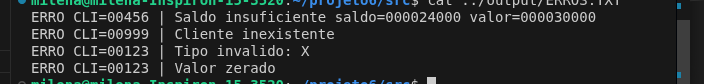
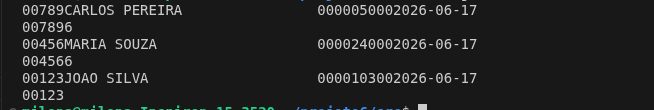

# Sistema de Contas Bancárias - Projeto 6 COBOL

## Sobre o Projeto

Sistema BATCH em COBOL para processamento diário de transações bancárias de débito e crédito. As informações dos clientes são armazenadas em tabelas DB2 e mantidas atualizadas após o processamento das transações.

Como o ambiente local não possui suporte nativo ao pré-compilador DB2, o projeto foi dividido em duas versões:

- **BANCO01.CBL**: versão oficial com SQL embarcado para ambiente Mainframe/DB2
- **BANCO01S.CBL**: simulador local usando arquivos indexados (VSAM) via GnuCOBOL

## Funcionalidades

- Leitura e ordenação dos arquivos de entrada
- Cadastro de clientes sem duplicidade (INSERT ou UPDATE)
- Validação de regras de negócio:
  - Nome obrigatório
  - Tipo de transação válido (C=Crédito, D=Débito)
  - Valor maior que zero
  - Saldo suficiente para débito
  - Cliente deve existir para processar transação
- Atualização de saldo no banco
- COMMIT a cada 100 registros
- ROLLBACK em caso de erro SQL
- Geração de relatórios, logs e arquivo de erros

## Estrutura do Projeto

    projeto6/
    ├── copybooks/
    │   ├── CPYCLIEN.CPY    # Layout arquivo clientes
    │   ├── CPYTRXIN.CPY    # Layout arquivo transações
    │   ├── CPYSQLCA.CPY    # SQL Communication Area
    │   ├── CPYIDXCL.CPY    # Registro indexado clientes
    │   ├── CPYIDXTR.CPY    # Registro indexado transações
    │   └── CPYIDXER.CPY    # Registro indexado erros
    ├── src/
    │   ├── BANCO01.CBL     # Versão oficial DB2/Mainframe
    │   └── BANCO01S.CBL    # Simulador local GnuCOBOL
    ├── input/
    │   ├── CLIENTES.TXT
    │   └── TRANSACOES.TXT
    ├── output/
    │   ├── RELATORIO.TXT
    │   ├── LOG.TXT
    │   └── ERROS.TXT
    ├── db/                 # Tabelas indexadas (geradas em runtime)
    ├── jcl/
    │   └── BANCO01.JCL     # JCL de treino
    └── images/             # Prints de execução

## Como Executar

### Requisitos
- GnuCOBOL 3.1.2
- Linux

### Compilar

    cd src/
    cobc -x -I ../copybooks BANCO01S.CBL -o BANCO01S

### Executar

    rm -f ../db/CLIENTES* ../db/TRANSACOES* ../db/ERROS* ../output/*.TXT
    ./BANCO01S

### Ver resultados

    cat ../output/RELATORIO.TXT
    cat ../output/ERROS.TXT
    cat ../output/LOG.TXT

## Resultados

### Compilação

### Relatório Final

### Log de Processamento

### Erros Detectados

### Banco de Dados

## Tecnologias

- COBOL (GnuCOBOL 3.1.2)
- IBM DB2 (versão oficial)
- Arquivos Indexados VSAM (simulador)
- JCL (treino)
- VS Code

## Autora

**Milena Costa**
